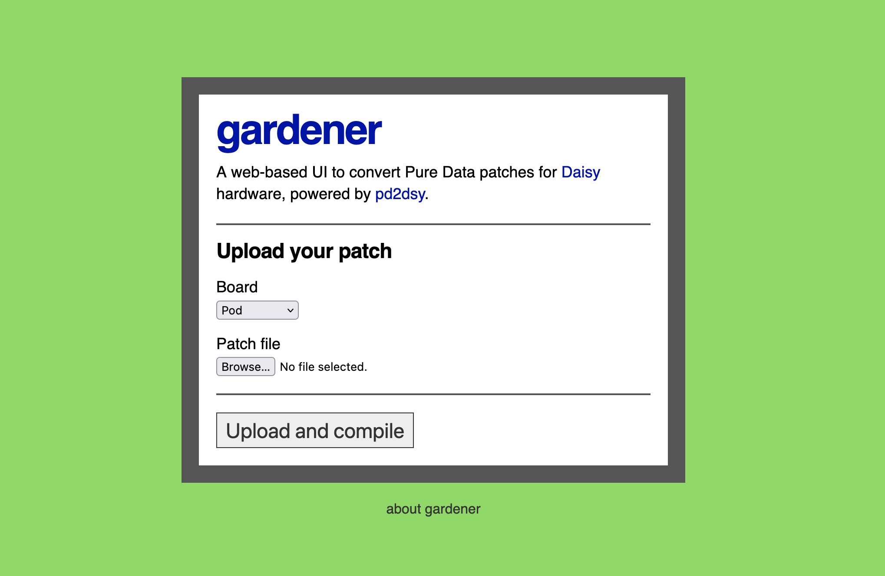

# gardener

A web interface around the [pd2dsy](https://github.com/electro-smith/pd2dsy) program, making it super easy to compile pure data patches for Daisy DSP boards.

Gardener is hosted at https://gardener.andrewjensen.io/ - try it out!

## Local development

- Install the [rust toolchain](https://rustup.rs/)
- Install the [pd2dsy toolchain](https://github.com/electro-smith/pd2dsy)
- Set the required env vars:
  - `DIR_WORKSPACE="/path/to/gardener/workspace"`
  - `DIR_PD2DSY="/path/to/pd2dsy"`
  - `ADMIN_TOKEN="some-shared-admin-token"`
  - `DISPLAY_COMPILATION_OUTPUT="false"`
- Compile and run the app: `cargo run`
- Navigate to http://localhost:8080 in your browser

## Hosting

You can build an image from the `Dockerfile` in the repo.

NOTE: there is currently a known issue where pd2dsy's `install.sh` script does not seem to take effect in the image layers, so `bin/container-start.sh` is a janky workaround that calls the script on startup. This means it might take a few minutes to actually start the container, but eventually it comes up properly and patches will compile. I gotta fix that in the future!
